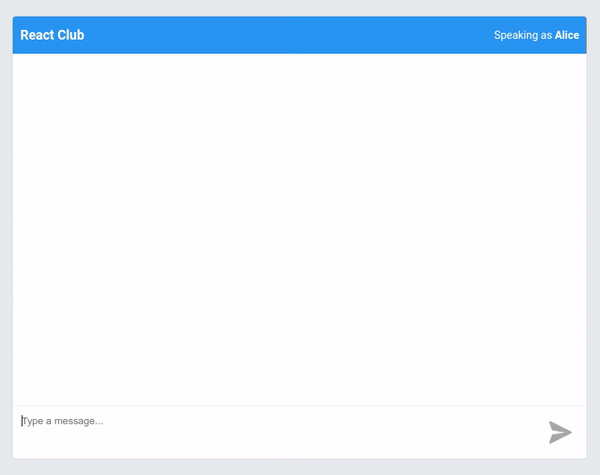

# Chat



## Demo
A demo is available on [chat.sigtot.com](https://chat.sigtot.com).

## Basic design
This is a very simple group chat, composed of a react frontend and a redis backend, with a quick-n-dirty websocket server written in go in between. The heavy lifting for the messaging itself is done by utilizing the pubsub features of redis.

## Dev usage
```bash
docker-compose up
```
Editing either the go or js source code will reload the respective components. 


## Status indicators
I have attempted to clone some of the behavior of Facebook Messenger's status indicators, as can be seen below. 

